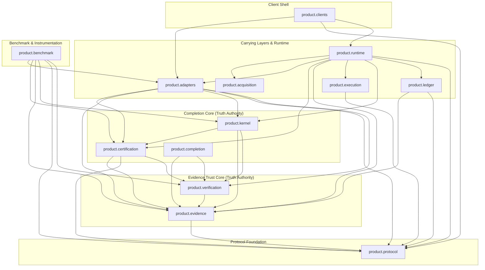

# Nexus Core Architecture Boundary

## Canonical Truth Authorities
1. **Evidence Trust Core**:
   - `product.evidence`: Evidence normalization, hashing, ingestion, and condition reduction.
   - `product.verification`: Verification reduction, status determination, and condition checks.
2. **Completion Core**:
   - `product.completion`: Advisory completion claims, evidence applicability, and freshness contract.
   - `product.certification`: Certification policy definition, receipt envelope sealing, and disposition.
   - `product.kernel`: Top-level certification engine (`certify`) evaluating evidence against policy.

## Non-authorities / Carrying Layers
- **Protocol Foundation** (`product.protocol`): Schema definitions, constants, and data exchange contracts.
- **Carrying Storage** (`product.ledger`): Append-only recording of evidence bundles and sealed receipts.
- **Carrying Acquisition** (`product.acquisition`): Remote GitHub or file-based input retrieval.
- **Carrying Execution** (`product.execution`): Deterministic test/verifier runner interfaces and execution profiles.
- **Carrying Adapters** (`product.adapters`): Schema adaptors translating external models to core inputs.
- **Carrying Runtime** (`product.runtime`): HTTP service, token auth, schema validation, and pipeline orchestration.
- **Client Shell** (`product.clients`): CLI, GitHub Action, MCP server, and local golden path entry points.
- **Instrumentation & Evaluation** (`product.benchmark`): Shadow evaluation kernels and benchmark harnesses.

## Prohibitions & Architectural Invariants
1. **Legacy Roots Prohibition**:
   This repository must never import or depend on:
   - `nexus.*`
   - `scripts.*`
   - `runtimes.*`
2. **Authority Boundary**:
   Truth authorities (`evidence`, `verification`, `completion`, `certification`, `kernel`) must never import client shells, runtimes, execution runners, acquisition, or benchmark layers.
3. **Protocol Purity**:
   `product.protocol` is a leaf data specification layer and must never import any other `product.*` package.
4. **Kernel Purity**:
   `product.kernel` handles pure certification logic and must never depend on remote acquisition (`product.acquisition`) or runtime transport (`product.runtime`).
5. **Benchmark Isolation**:
   `product.benchmark` is an instrumentation harness; no production component outside `product.benchmark` may import it.

## Executable Conformance Enforcement
Architecture boundaries are deterministically enforced directly from Python AST imports by:
- `tests/architecture/conformance.py`
- `tests/architecture/test_architecture_conformance.py`
- `tests/architecture/test_no_legacy_nexus_dependency.py`

## Source-Derived Architecture Graph
The following diagram is a direct projection of the actual source dependency graph validated by CI:

